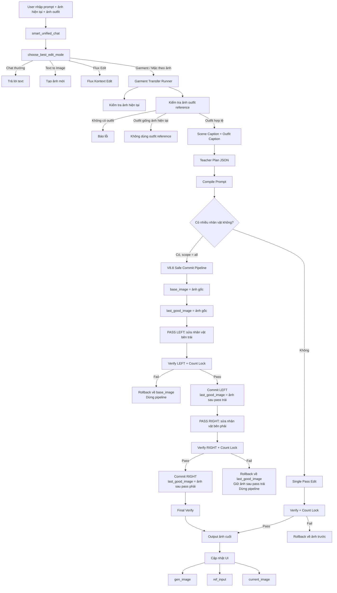

# YumeAI Workflow

```mermaid
flowchart TD
    A[User nhập prompt + ảnh hiện tại + ảnh outfit] --> B[smart_unified_chat]

    B --> C[choose_best_edit_mode]

    C -->|Chat thường| C1[Trả lời text]
    C -->|Text to Image| C2[Tạo ảnh mới]
    C -->|Flux Edit| C3[Flux Kontext Edit]
    C -->|Garment / Mặc theo ảnh| D[Garment Transfer Runner]

    D --> E[Kiểm tra ảnh hiện tại]
    D --> F[Kiểm tra ảnh outfit reference]

    F -->|Không có outfit| F1[Báo lỗi]
    F -->|Outfit giống ảnh hiện tại| F2[Không dùng outfit reference]
    F -->|Outfit hợp lệ| G[Scene Caption + Outfit Caption]

    G --> H[Teacher Plan JSON]
    H --> I[Compile Prompt]

    I --> J{Có nhiều nhân vật không?}

    J -->|Không| K[Single Pass Edit]
    J -->|Có, scope = all| L[V8.8 Safe Commit Pipeline]

    L --> M[base_image = ảnh gốc]
    M --> N[last_good_image = ảnh gốc]

    N --> O[PASS LEFT: sửa nhân vật bên trái]
    O --> P[Verify LEFT + Count Lock]

    P -->|Fail| P1[Rollback về base_image<br/>Dừng pipeline]
    P -->|Pass| Q[Commit LEFT<br/>last_good_image = ảnh sau pass trái]

    Q --> R[PASS RIGHT: sửa nhân vật bên phải]
    R --> S[Verify RIGHT + Count Lock]

    S -->|Fail| S1[Rollback về last_good_image<br/>Giữ ảnh sau pass trái<br/>Dừng pipeline]
    S -->|Pass| T[Commit RIGHT<br/>last_good_image = ảnh sau pass phải]

    T --> U[Final Verify]
    U --> V[Output ảnh cuối]

    K --> W[Verify + Count Lock]
    W -->|Fail| W1[Rollback về ảnh trước]
    W -->|Pass| V

    V --> X[Cập nhật UI]
    X --> X1[gen_image]
    X --> X2[ref_input]
    X --> X3[current_image]
```